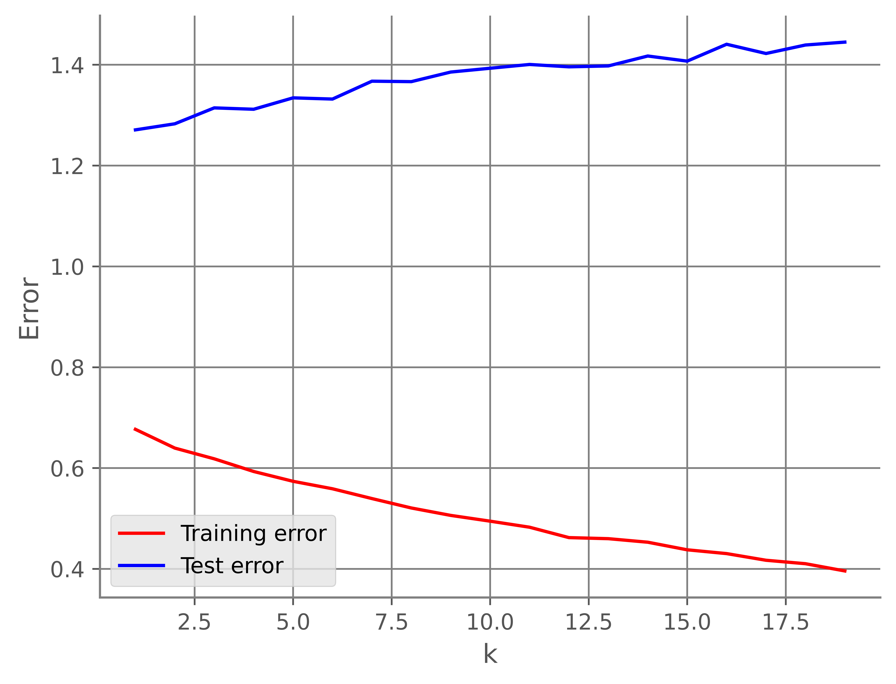

# Matrix Factorization for Recommendation Systems

This project implements ecommendation system from scratch using **pure NumPy**, exploring SVD, NMF (Lee & Seung, NNLS-ALS), and SGD-based approaches. The system predicts user ratings using the **MovieLens dataset** and also visualizes clusters in the latent space.

---

## Key Takeaways

- **Low-Rank Approximation SVD**: Requires imputation and performs poorly overall.  
  

  
  

  The graph shows the final training and test MSE for different rank-$k$ approximations.
- **Non-negative Matrix Factorization (NMF)**: What we want to solve is:
    $'
    \min _{M, U} \sum_{(i, j) \in \kappa} \left(r_{ij} - M_i U_j^T\right)^2 + \lambda \left(\left\|M_i\right\|^2 + \left\|U_j\right\|^2\right),
    \quad \text{s.t.} \quad M \geq 0, \, U \geq 0
    '$

    Following Lee and Seung[^1], the multiplicative update rule, without regularization, for $M$ and $U$ are as follows:

    $'
    M \leftarrow M \cdot \frac{RU}{MU^{\top}U}
    '$

    $'
    U \leftarrow U \cdot \frac{R^{\top}M}{UM^{\top}M}
    '$

    However, since $R$ is a sparse matrix, we need to update each $M_i$ according to existing ratings of the movie $i$. Similarly, we need to update $U_j$ according to existing ratings of the user $j$. Together with a regularization parameter $\lambda$ we have:

    $'
    M_{i,k} \leftarrow M_{i,k} \cdot \frac{\sum_{j \in M_i^*}U_{j,k}\cdot r_{i,j}}{\sum_{j \in M_i^*}U_{j,k}\cdot \hat{r}_{i,j} + \lambda|M_u^*|M_{i,k}}
    '$

    $'
    U_{j,k} \leftarrow U_{j,k} \cdot \frac{\sum_{u \in U_i^*}M_{i,k}\cdot r_{i,j}}{\sum_{u \in U_j^*}M_{i,k}\cdot \hat{r}_{i,j} + \lambda|U_j^*|U_{i,k}}
    '$

    Where:

    - $M_{i,k}$ is the $k^{th}$ latent factor of $M_i$
    - $U_{j,k}$ is the $k^{th}$ latent factor of $U_j$
    - $M_i^*$ is the set of users who rated movie $i$
    - $U_j^*$ is the set of movies rated by user $j$

    

    
    

    This image shows the final train and test error with varying $k$.

    This method is definitely more robust and interpretable and also avoids overfitting better than SVD. 

- **Non-negative least squares (NNLS-ALS)**:
    The idea, as the name suggest, is to rotate between fixing the  $M_i$'s and fixing the $U_j$'s. It was put into practice by Bro and De Jong[^2]. The algorithm is essentially:

    Repeat until the convergence criterion is met:
    1. For $i = 1$ to $n$:
       - Compute NNLS for:
           $'
           \underbrace{\left(\sum_{r_{ij} \in r_{i *}} U_j U_j^{\top} + \lambda I_k \right)}_\text{A} M_i = 
           \underbrace{\sum_{r_{ij} \in r_{i *}} r_{ui} U_j}_\text{b}
           '$

    2. For $j = 1$ to $m$:
       - Compute NNLS for:
           $'
           \underbrace{\left(\sum_{r_{ij} \in r_{* j}} M_i M_i^{\top} + \lambda I_k \right)}_\text{A} U_j = 
           \underbrace{\sum_{r_{ij} \in r_{* j}} r_{ui} M_i}_\text{b}
           '$
    
    

    
    

    This image shows the final train and test error with varying $k$.

For more details check the main [document](RecommendationSystems.pdf).

## References
[^1]: Daniel D. Lee and H. Sebastian Seung. [Algorithms for non-negative matrix factorization.](https://dl.acm.org/doi/10.5555/3008751.3008829) In Proceedings of the 13th International Conference on Neural Information Processing Systems, NIPS’00, page 535–541, Cambridge, MA, USA, 2000. MIT Press.
[^2]: Rasmus Bro and Sijmen de Jong. [A fast non-negativity-constrained least squares algorithm.](https://doi.org/10.1002/(SICI)1099-128X(199709/10)11:5%3C393::AID-CEM483%3E3.0.CO;2-L) Journal of Chemometrics, 11, 1997.
